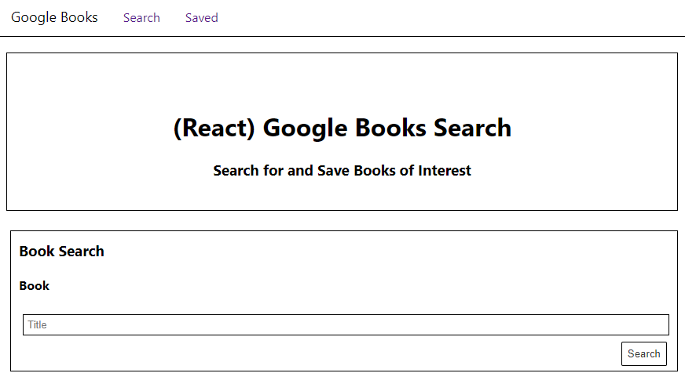
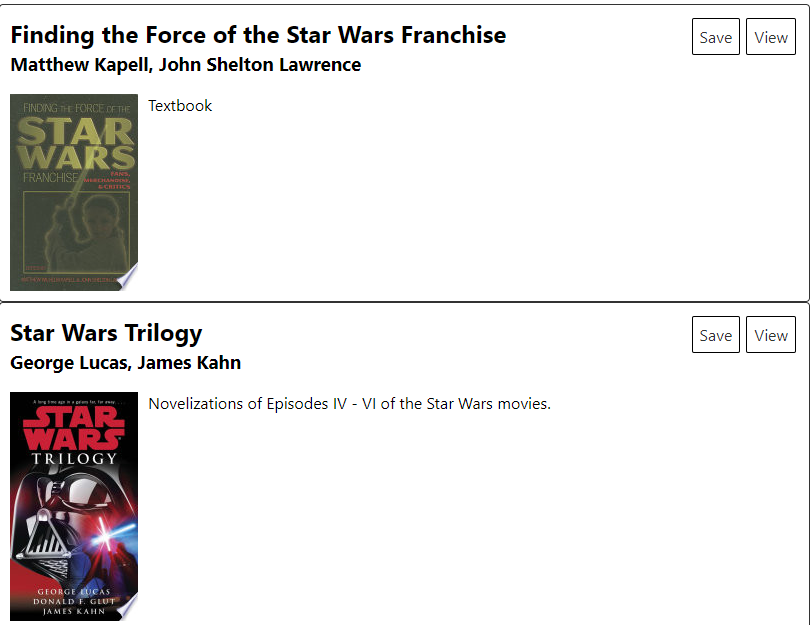
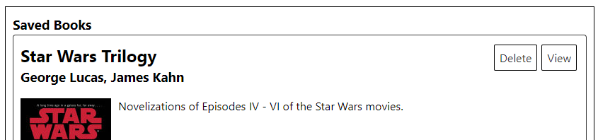

# book-search

A Google books api search engine featuring React and mongodb. [Try it out here](https://arcane-everglades-43040.herokuapp.com/).

# Installation

1. Clone the repo.

`git clone https:\\github.com\GuyFromHere\book-search.git`

2. Run npm install from the root directory.

`npm install`

3. Start the app.

`npm start`

# How to use the app

Enter a book title on the search page and click Search:

Find the books that interest you and click View to open a link to the Google store in a new tab.

Or click Save to save the book to the database for future viewing. To view saved books, click Saved in the nav bar:

